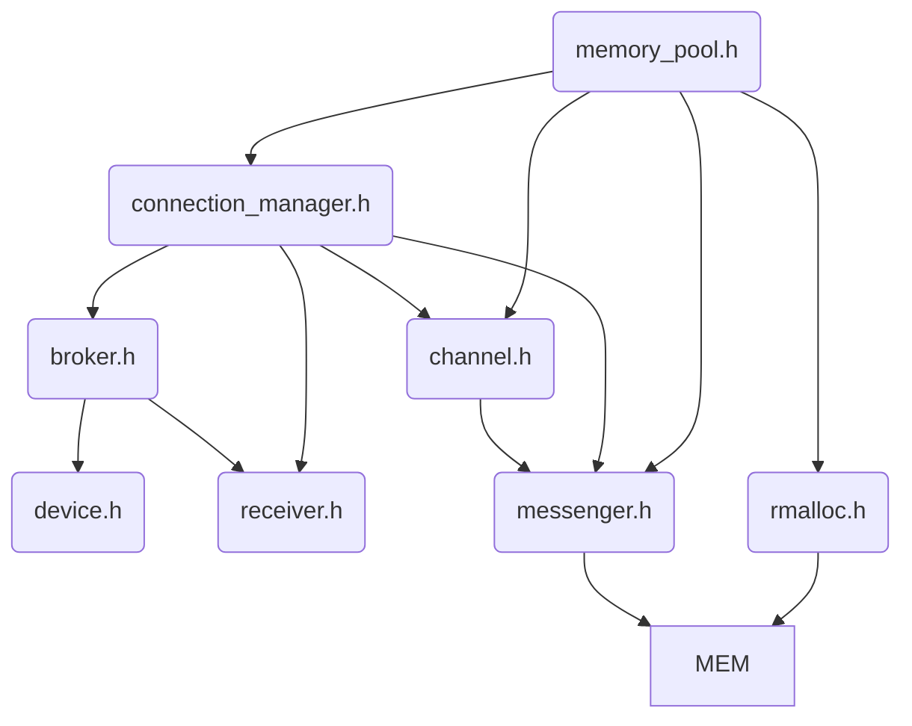

# Scratch Notes

```mermaid
graph TD
    B(broker.h) --> D
    B(broker.h) --> RCV
    CH(channel.h) --> MSG
    CM(connection_manager.h) --> CH
    CM(connection_manager.h) --> MSG
    CM(connection_manager.h) --> RCV
    CM(connection_manager.h) --> B
    D(device.h)
    MP(memory_pool.h) --> CH
    MP(memory_pool.h) --> CM
    MP(memory_pool.h) --> MSG
    MP(memory_pool.h) --> RM
    MSG(messenger.h) --> MEM
    RCV(receiver.h)
    RM(rmalloc.h) --> MEM
```
